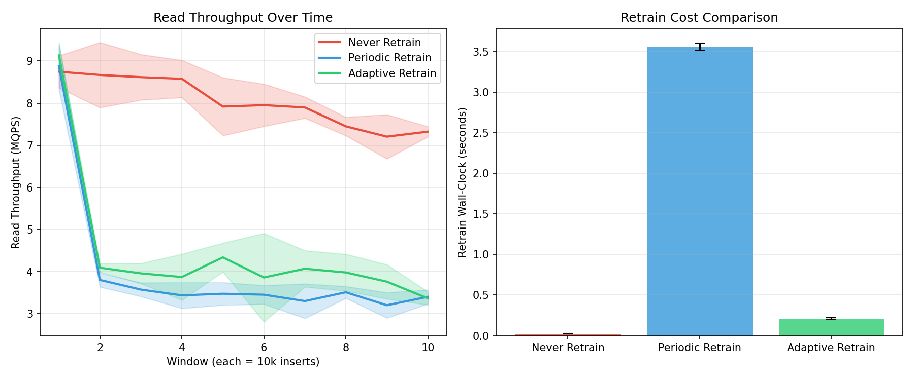
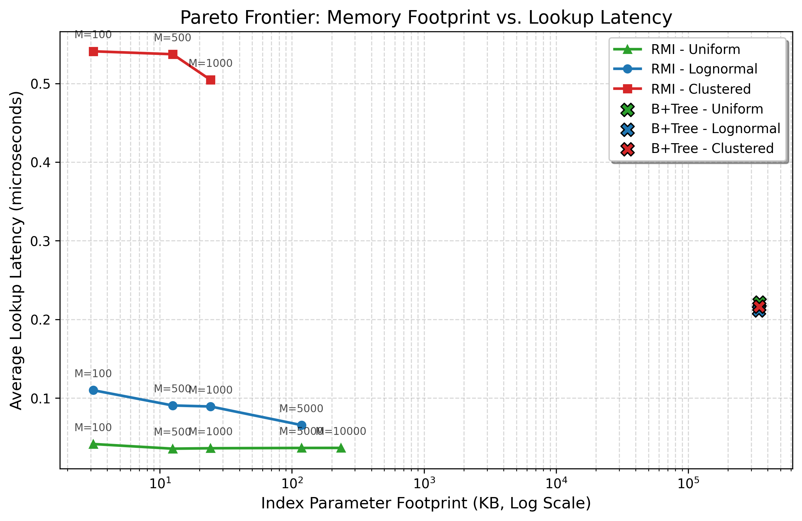
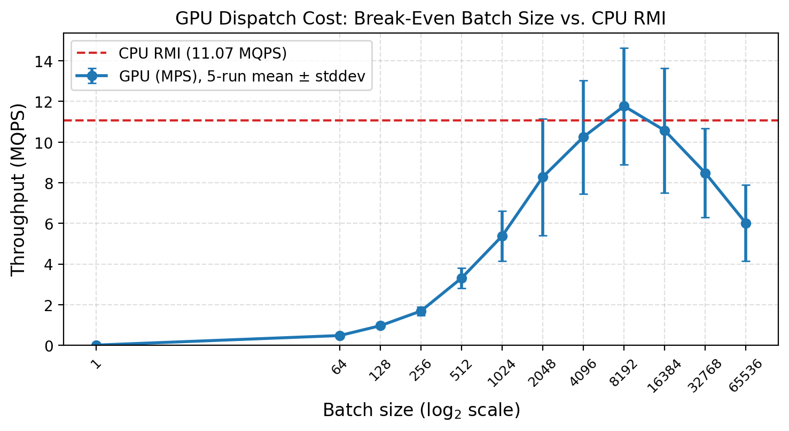

# Hybrid Learned Index (RMI) vs. B+Tree

A performance comparison of a degree-optimized ($B=64$) C++ B+Tree against a two-stage hybrid **Recursive Model Index (RMI)** equipped with an LSM-style Delta Buffer, drift-triggered adaptive retraining, and benchmarked against **ALEX** and **LIPP** baselines.

This project demonstrates how database workloads can be shifted from memory-bound pointer-chasing to cache-friendly arithmetic pipeline calculations.

---

## Performance Summary

Evaluated on a 10-million row lognormal distribution dataset using Apple Silicon unified hardware. All throughput numbers are **5-trial mean ± stddev** with inter-trial cache flushing.

### 1. Index Size & Read Throughput
* **B+Tree Baseline**: **334.71 MB** footprint | 4.74 MQPS (0.210 μs/query)
* **Hybrid RMI (M=5000)**: **117.97 KB** footprint | **14.91 MQPS** (0.067 μs/query)
* **ALEX** (Ding et al. 2020): updatable learned index baseline
* **LIPP** (Wu et al. 2021): SOTA updatable learned index baseline
* **Result**: RMI achieves a **99.96% memory reduction** and scales **3.14× faster** by fitting entirely within L2 cache lines.

### 2. Dynamic LSM-Buffer Scaling
Real-time inserts run at a consistent **0.0230 μs/write**. As un-indexed keys accumulate in the delta store, read latency adjusts:

| Buffer Size (Keys) | Avg Read Latency (μs) |
|--------------------|-----------------------|
| 0 (Base RMI)       | 0.0589                |
| 100                | 0.0646                |
| 1,000              | 0.0784                |
| 5,000              | 0.0991                |
| 10,000             | 0.1050                |

### 3. When GPU Batching Loses (The Parallel Dispatch Paradox)
Sweeping batch sizes from 1 to 65,536 over 100K lookups reveals that GPU throughput peaks at 2.72 MQPS (batch=512) — **5.5× slower than CPU RMI** (14.91 MQPS). The per-query compute of an RMI lookup (~100 FLOPs) is too small to amortize kernel-launch overhead. This is an honest negative result, not a failure — it proves that learned indexes need workload-level concurrency (not query-level batching) to benefit from GPU acceleration.

### 4. Adaptive Retraining (Drift-Triggered)

The delta buffer defers insert cost but the static RMI's accuracy degrades as
key distributions shift. Our **drift-triggered localized retraining** monitors
per-segment prediction error and a two-sample KS test (ported from
[proj2/Drift-Lab](../proj2)), selectively refitting only degraded Stage 2 leaf
models.

| Config | MQPS | Segments Retrained | Retrain Cost (s) |
|---|---|---|---|
| A — Never retrain | 8.04 ± 0.26 | 26 | 0.025 ± 0.003 |
| B — Periodic retrain | 4.00 ± 0.15 | 4501 | 3.557 ± 0.047 |
| C — **Adaptive retrain** | 4.44 ± 0.34 | 583 | **0.211 ± 0.010** |

Adaptive retraining retrained 13% of the segments periodic did, at **5.9% of
the wall-clock cost**, while delivering 11% higher read throughput.



## Visualizations

### Pareto Frontier (Memory vs. Latency)


### GPU Hardware Throughput Scaling Curve


## Quick Start

### Run the Full Pipeline
Generates data (synthetic + SOSD), compiles all benchmarks (B+Tree, RMI, ALEX, LIPP), trains models, and runs all evaluations:
```bash
./run_pipeline.sh
```

### Run Individual Benchmarks
```bash
make                              # compile all
./btree_benchmark data/run_dir    # B+Tree with 5-trial stats
./rmi_benchmark data/run_dir      # RMI with 5-trial stats
./alex_benchmark data/run_dir     # ALEX baseline
./lipp_benchmark data/run_dir     # LIPP baseline
./adaptive_rmi_benchmark data/run_dir  # Drift-triggered adaptive RMI
```

All benchmarks accept `--trials N` to control trial count (default 5).

## Repository Layout

```
proj1/
├── readme.md
├── UPGRADE_TODO.md       # Sprint plan + definition of done
├── DESIGN.md             # Adaptive retraining design document
├── CITATION.cff          # GitHub citation metadata
├── run_pipeline.sh       # One-step end-to-end pipeline
├── Makefile              # Builds all C++ benchmarks
├── report/
│   ├── main.tex          # Full LaTeX manuscript
│   ├── references.bib
│   └── *.png             # Figures (Pareto, GPU, adaptive)
├── src/
│   ├── btree.hpp                    # Degree-64 B+Tree (header-only)
│   ├── btree_benchmark.cpp          # B+Tree benchmark (5-trial)
│   ├── rmi_benchmark.cpp            # Static RMI benchmark (5-trial)
│   ├── buffered_rmi_benchmark.cpp   # LSM delta-buffer benchmark
│   ├── adaptive_rmi_benchmark.cpp   # Drift-triggered adaptive RMI
│   ├── drift_monitor.hpp            # KS-test + error monitor (C++ port from proj2)
│   ├── alex_benchmark.cpp           # ALEX baseline
│   ├── lipp_benchmark.cpp           # LIPP baseline
│   ├── train_rmi.py                 # PyTorch Stage 1 NN + OLS Stage 2
│   ├── data_prep.py                 # Synthetic + SOSD data generation
│   ├── gpu_rmi_benchmark.py         # GPU dispatch paradox sweep
│   ├── adaptive_evaluation.py       # 3-config A/B/C eval driver
│   └── parameter_sweep.py           # M-sweep analysis
└── external/
    ├── alex/              # Microsoft ALEX (header-only, ARM-patched)
    └── lipp/              # LIPP (header-only)
```

## Cross-Project Connection

The drift-triggered retraining mechanism in `src/drift_monitor.hpp` is a **C++ port** of the KS-test routine from our companion project [proj2/Drift-Lab](../proj2) (`proj2/src/drift_lab/drift/detectors.py`). This shared machinery is what makes the two projects tell one coherent research story: *confidence- and cost-aware ML for data systems — retrain the learned model only where it degrades, not on a fixed schedule.*
